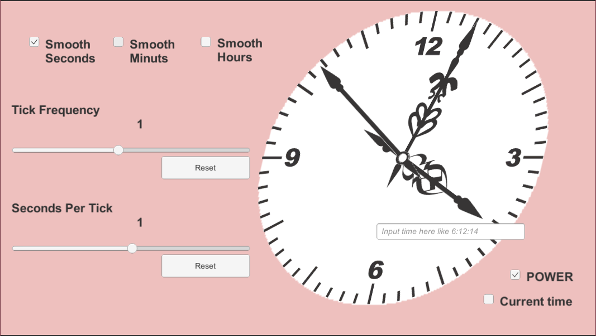

# AnalogClock
An Unity asset to display the simple analog clock.

# Demo Image

[Play demo here!](https://usamiki.github.io/AnalogClock/WebGLDemo/index.html "Demo")

# Features
- Display the current time.
- Can set the time freely.
- Smooth mode for seconds, minutes and hours.
- Accelerate, decelerate and reverse.
- The sample is 2D, but you can probably attach 3D objects as well.

# Thanks

とぉる 様 (https://www.pixiv.net/users/1949442)  
時計の画像素材を使わせていただきました。
- https://www.pixiv.net/artworks/33000226

# License
Apache License 2.0
